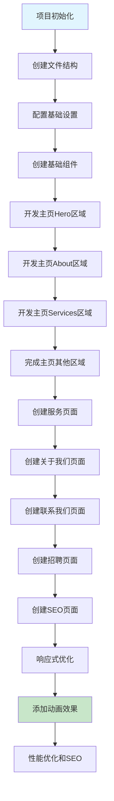
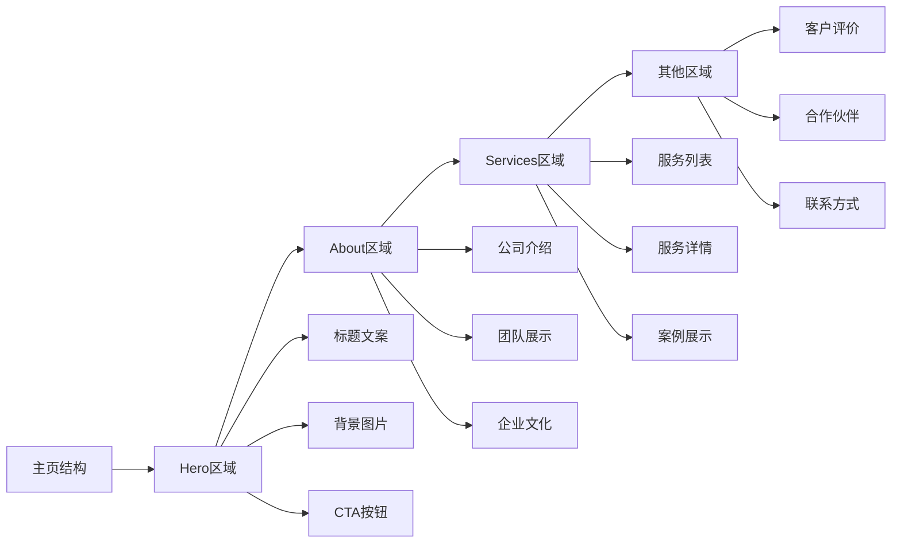

# Next.js 公司官网开发流程

## 开发阶段概览

## 主页开发详细流程

## 组件开发优先级

1. **核心布局组件**
   - Header/Navigation
   - Footer
   - Layout

2. **基础UI组件**
   - Button
   - Card
   - Input
   - Modal

3. **主页核心区域**
   - Hero Section
   - About Section
   - Services Section

4. **其他页面组件**
   - 服务页面
   - 关于我们页面
   - 联系我们页面
   - 招聘页面
   - SEO服务页面

## 技术栈

- **框架**: Next.js 13+ (App Router)
- **语言**: TypeScript
- **UI组件库**: Ant Design
- **样式**: Tailwind CSS (用于布局和自定义样式)
- **图标**: Ant Design Icons
- **动画**: Framer Motion (可选)
- **表单**: Ant Design Form + React Hook Form (可选)
- **图片优化**: Next.js Image 组件