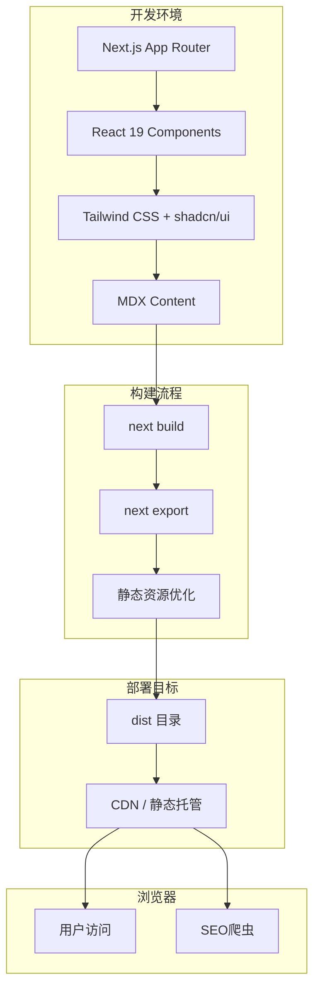
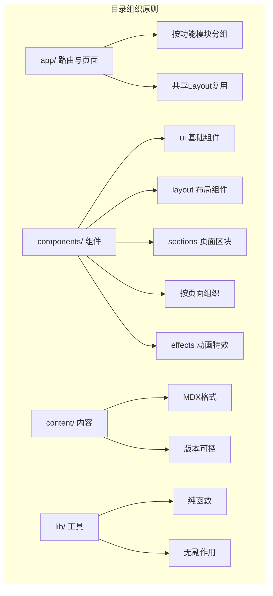
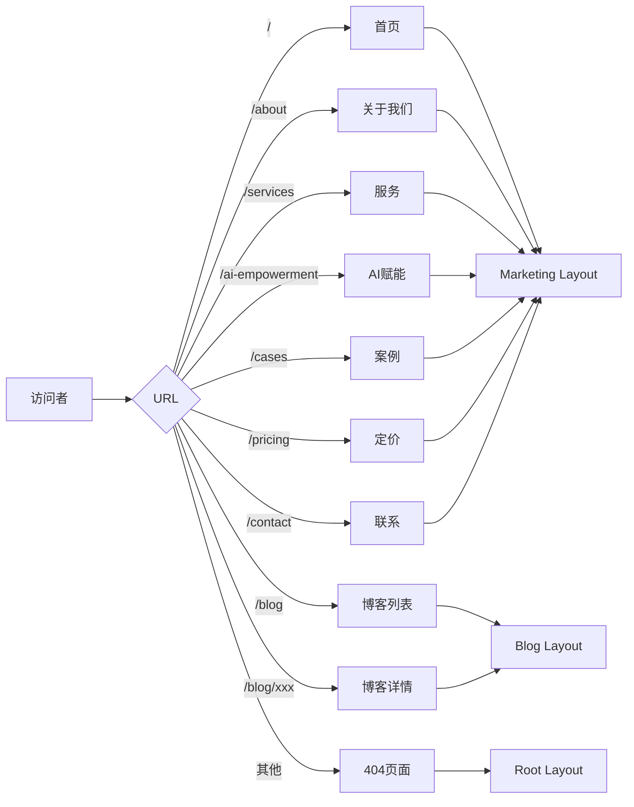
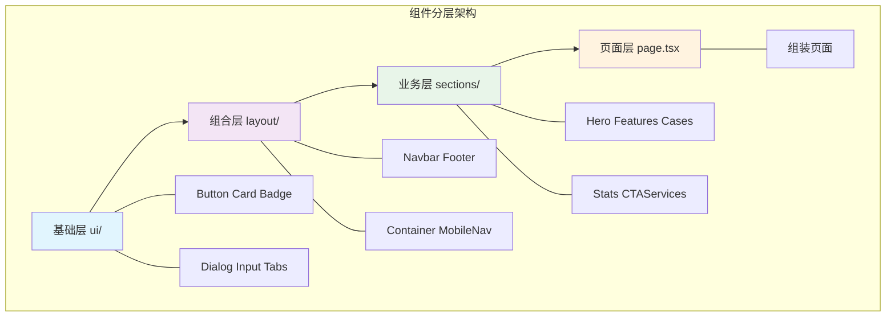
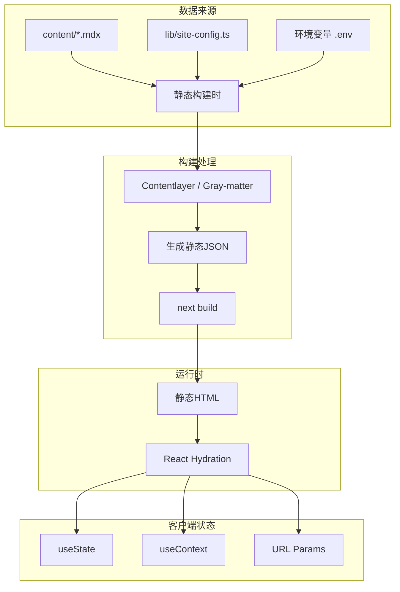

# 彼励扶（BelieveBoy）官网技术架构设计文档

> **版本**: 1.0  
> **日期**: 2026-01-30  
> **架构师**: Kilo Code  

---

## 📋 目录

1. [架构概览](#一-架构概览)
2. [技术选型与理由](#二-技术选型与理由)
3. [项目目录结构](#三-项目目录结构)
4. [路由设计](#四-路由设计)
5. [组件组织方式](#五-组件组织方式)
6. [数据流设计](#六-数据流设计)
7. [SEO策略](#七-seo策略)
8. [性能优化方案](#八-性能优化方案)
9. [开发规范](#九-开发规范)
10. [第三方库清单](#十-第三方库清单)

---

## 一、架构概览

### 1.1 架构目标

| 目标 | 说明 |
|------|------|
| **静态生成 (SSG)** | 支持 `next export`，便于部署到任何CDN |
| **SEO友好** | 完整的Meta管理、结构化数据、Sitemap |
| **性能优秀** | Core Web Vitals全绿，首屏<1.5s |
| **可维护性** | 清晰的目录结构，组件化设计 |
| **扩展性** | 易于添加新页面和功能模块 |

### 1.2 技术栈总览

```
┌─────────────────────────────────────────────────────────────────┐
│                        技术架构总览                               │
├─────────────────────────────────────────────────────────────────┤
│  前端框架       │  Next.js 15 + React 19 + TypeScript             │
├─────────────────────────────────────────────────────────────────┤
│  样式方案       │  Tailwind CSS 4 + shadcn/ui + Framer Motion      │
├─────────────────────────────────────────────────────────────────┤
│  内容管理       │  MDX + Contentlayer（博客内容）                  │
├─────────────────────────────────────────────────────────────────┤
│  构建部署       │  Next.js Static Export + 任意CDN                │
├─────────────────────────────────────────────────────────────────┤
│  辅助工具       │  ESLint + Prettier + Husky                      │
└─────────────────────────────────────────────────────────────────┘
```

### 1.3 系统架构图



---

## 二、技术选型与理由

### 2.1 前端框架：Next.js 15

| 特性 | 理由 |
|------|------|
| **Static Export** | 完美支持纯静态导出，无需服务器 |
| **App Router** | 现代化的文件系统路由，支持Layout |
| **Image Optimization** | 自动图片优化，支持懒加载 |
| **SEO友好** | 内置Metadata API，支持SSR元数据 |
| **TypeScript优先** | 原生TS支持，类型安全 |

### 2.2 UI库：shadcn/ui + Tailwind CSS 4

| 特性 | 理由 |
|------|------|
| **组件丰富** | 50+高质量组件，覆盖常见需求 |
| **可定制性** | 基于Tailwind，样式完全可控 |
| **商务科技风格** | 适合彼励扶的专业科技形象 |
| **无障碍支持** | 内置ARIA支持 |

### 2.3 内容管理：MDX

| 特性 | 理由 |
|------|------|
| **Markdown + JSX** | 技术博客的理想格式 |
| **内容分离** | 内容与代码分离，便于内容管理 |
| **Git版本控制** | 内容变更可追溯 |
| **无需CMS** | 降低维护复杂度 |

### 2.4 动画库：Framer Motion

| 特性 | 理由 |
|------|------|
| **React原生** | 声明式动画API |
| **性能优秀** | 自动使用GPU加速 |
| **滚动动画** | 支持滚动触发动画，提升体验 |

---

## 三、项目目录结构

### 3.1 完整目录树

```
believeboy-website/
├── app/                              # Next.js App Router 主目录
│   ├── layout.tsx                    # 根布局
│   ├── page.tsx                      # 首页
│   ├── globals.css                   # 全局样式
│   ├── metadata.ts                   # 全局元数据配置
│   │
│   ├── (marketing)/                  # 营销页面组（共享布局）
│   │   ├── layout.tsx                # 营销页布局（导航+页脚）
│   │   ├── about/
│   │   │   └── page.tsx              # 关于我们
│   │   ├── services/
│   │   │   └── page.tsx              # 服务介绍
│   │   ├── ai-empowerment/
│   │   │   └── page.tsx              # AI赋能
│   │   ├── cases/
│   │   │   └── page.tsx              # 案例展示
│   │   ├── pricing/
│   │   │   └── page.tsx              # 定价方案
│   │   └── contact/
│   │       └── page.tsx              # 联系我们
│   │
│   ├── blog/                         # 博客模块
│   │   ├── page.tsx                  # 博客列表页
│   │   ├── layout.tsx                # 博客布局
│   │   └── [slug]/
│   │       └── page.tsx              # 博客详情页
│   │
│   └── not-found.tsx                 # 404页面
│
├── components/                       # 组件目录
│   ├── ui/                          # shadcn/ui 基础组件
│   │   ├── button.tsx
│   │   ├── card.tsx
│   │   ├── badge.tsx
│   │   ├── dialog.tsx
│   │   ├── input.tsx
│   │   ├── tabs.tsx
│   │   └── ...
│   │
│   ├── layout/                      # 布局组件
│   │   ├── navbar.tsx               # 导航栏
│   │   ├── footer.tsx               # 页脚
│   │   ├── mobile-nav.tsx           # 移动端导航
│   │   └── container.tsx            # 容器组件
│   │
│   ├── sections/                    # 页面区块组件
│   │   ├── home/
│   │   │   ├── hero.tsx             # 首页Banner
│   │   │   ├── features.tsx         # 特性展示
│   │   │   ├── services.tsx         # 服务概览
│   │   │   ├── ai-showcase.tsx      # AI能力展示
│   │   │   ├── cases.tsx            # 案例预览
│   │   │   ├── stats.tsx            # 数据统计
│   │   │   └── cta.tsx              # 行动召唤
│   │   │
│   │   ├── about/
│   │   ├── services/
│   │   ├── cases/
│   │   └── shared/
│   │       ├── section-header.tsx   # 区块标题
│   │       ├── animated-counter.tsx # 动画计数器
│   │       └── gradient-card.tsx    # 渐变卡片
│   │
│   ├── effects/                     # 特效组件
│   │   ├── fade-in.tsx              # 淡入动画
│   │   ├── slide-up.tsx             # 上滑动画
│   │   ├── stagger-container.tsx    # 交错动画容器
│   │   ├── gradient-text.tsx        # 渐变文字
│   │   └── particle-bg.tsx          # 粒子背景
│   │
│   └── forms/                       # 表单组件
│       ├── contact-form.tsx         # 联系表单
│       └── newsletter-form.tsx      # 订阅表单
│
├── content/                         # 内容数据
│   ├── blog/                        # 博客文章
│   │   ├── ai-scenes.mdx
│   │   ├── cosmo-algorithm-2025.mdx
│   │   └── ...
│   ├── cases/                       # 案例数据
│   │   ├── gas-grill.mdx
│   │   ├── glass-food-pan.mdx
│   │   └── memory-foam-mattress.mdx
│   └── site-config.ts               # 站点配置
│
├── lib/                             # 工具函数
│   ├── utils.ts                     # 通用工具
│   ├── content.ts                   # 内容处理
│   ├── seo.ts                       # SEO工具
│   └── analytics.ts                 # 分析工具
│
├── hooks/                           # 自定义Hooks
│   ├── use-scroll-position.ts
│   ├── use-media-query.ts
│   └── use-intersection.ts
│
├── types/                           # TypeScript类型
│   ├── index.ts
│   ├── blog.ts
│   └── case.ts
│
├── public/                          # 静态资源
│   ├── images/
│   │   ├── logo.svg
│   │   ├── hero/
│   │   ├── cases/
│   │   ├── team/
│   │   └── blog/
│   ├── fonts/
│   ├── favicon.ico
│   └── robots.txt
│
├── styles/                          # 样式配置
│   └── tailwind.config.ts
│
├── next.config.ts                   # Next.js配置
├── tsconfig.json                    # TypeScript配置
├── package.json
├── .eslintrc.json
├── .prettierrc
└── README.md
```

### 3.2 目录组织原则



---

## 四、路由设计

### 4.1 路由表

| 路径 | 页面 | 说明 |
|------|------|------|
| `/` | 首页 | 公司概览与核心价值 |
| `/about` | 关于我们 | 公司介绍、理念、团队 |
| `/services` | 服务介绍 | 核心服务与能力 |
| `/ai-empowerment` | AI赋能 | AI技术能力与场景 |
| `/cases` | 案例展示 | 成功案例与数据 |
| `/pricing` | 定价方案 | 服务套餐与价格 |
| `/contact` | 联系我们 | 联系方式与表单 |
| `/blog` | 博客列表 | 文章列表与筛选 |
| `/blog/[slug]` | 博客详情 | 单篇文章 |
| `*` | 404 | 未找到页面 |

### 4.2 路由分组策略

```
app/
├── layout.tsx              # 根布局（全局Provider）
├── page.tsx                # / 首页
├── not-found.tsx           # 404页面
│
├── (marketing)/            # 营销页分组
│   ├── layout.tsx          # 营销页共享布局（导航+页脚）
│   ├── about/page.tsx      # /about
│   ├── services/page.tsx   # /services
│   ├── ai-empowerment/     # /ai-empowerment
│   ├── cases/page.tsx      # /cases
│   ├── pricing/page.tsx    # /pricing
│   └── contact/page.tsx    # /contact
│
└── blog/                   # 博客模块（独立布局）
    ├── layout.tsx
    ├── page.tsx            # /blog
    └── [slug]/
        └── page.tsx        # /blog/[slug]
```

### 4.3 路由架构图



---

## 五、组件组织方式

### 5.1 组件分层架构



### 5.2 组件设计规范

#### 基础组件 (UI Components)
```typescript
// components/ui/button.tsx
import { Button } from '@/components/ui/button'

// 使用：直接复用 shadcn/ui 组件
// 特性：无业务逻辑，纯样式+交互
```

#### 布局组件 (Layout Components)
```typescript
// components/layout/navbar.tsx
// 职责：页面导航，响应式设计
// 依赖：ui/button, ui/navigation-menu
```

#### 页面区块 (Section Components)
```typescript
// components/sections/home/hero.tsx
// 职责：首页Banner区域
// 依赖：ui/button, effects/gradient-text
// 数据：content/site-config.ts
```

#### 特效组件 (Effect Components)
```typescript
// components/effects/fade-in.tsx
// 职责：封装动画逻辑
// 依赖：framer-motion
// 复用：所有需要动画的组件
```

### 5.3 组件依赖关系

```
page.tsx
  ├── layout/navbar.tsx
  │     └── ui/navigation-menu.tsx
  ├── sections/home/hero.tsx
  │     ├── ui/button.tsx
  │     ├── effects/gradient-text.tsx
  │     └── effects/fade-in.tsx
  ├── sections/home/features.tsx
  │     ├── ui/card.tsx
  │     └── effects/slide-up.tsx
  └── layout/footer.tsx
        └── ui/button.tsx
```

---

## 六、数据流设计

### 6.1 数据架构



### 6.2 内容数据处理

#### 博客内容
```typescript
// lib/content.ts
import { getBlogPosts, getBlogPost } from '@/lib/content'

// 构建时获取所有博客
export async function getBlogPosts() {
  // 读取 content/blog/*.mdx
  // 解析 frontmatter
  // 返回排序后的文章列表
}

// 获取单篇博客
export async function getBlogPost(slug: string) {
  // 读取单个MDX文件
  // 解析内容+元数据
}
```

#### 案例数据
```typescript
// content/cases/case-data.ts
export const cases = [
  {
    id: 'gas-grill',
    title: 'Gas Grill 高端户外烧烤炉',
    category: '户外用品',
    results: {
      salesGrowth: '+180%',
      acosReduction: '45% → 22%',
      ranking: 'TOP 3'
    },
    image: '/images/cases/gas-grill.jpg'
  },
  // ...
]
```

### 6.3 表单数据处理

```typescript
// 联系表单提交
// 方案：使用 Formspree / Getform / 自有API
// 静态导出不支持API路由，使用第三方表单服务

const handleSubmit = async (data: ContactFormData) => {
  const response = await fetch('https://formspree.io/f/YOUR_FORM_ID', {
    method: 'POST',
    body: JSON.stringify(data),
    headers: { 'Content-Type': 'application/json' }
  })
}
```

---

## 七、SEO策略

### 7.1 元数据管理

```typescript
// app/metadata.ts
import { Metadata } from 'next'

export const defaultMetadata: Metadata = {
  title: {
    template: '%s | 彼励扶 - 让中国品牌闪耀全球',
    default: '彼励扶 - 专业跨境电商运营 × AI智能驱动',
  },
  description: '彼励扶电子商务（苏州）有限公司，专注为中国品牌提供全链路跨境电商解决方案。',
  keywords: ['跨境电商', '亚马逊运营', 'AI电商', '品牌出海', '电商代运营'],
  authors: [{ name: '彼励扶' }],
  creator: '彼励扶电子商务（苏州）有限公司',
  metadataBase: new URL('https://believeboy.com'),
  alternates: {
    canonical: '/',
  },
  openGraph: {
    type: 'website',
    locale: 'zh_CN',
    siteName: '彼励扶',
  },
  twitter: {
    card: 'summary_large_image',
  },
  robots: {
    index: true,
    follow: true,
  },
}
```

### 7.2 页面级SEO配置

```typescript
// app/about/page.tsx
import { Metadata } from 'next'

export const metadata: Metadata = {
  title: '关于我们',
  description: '了解彼励扶电子商务（苏州）有限公司，我们是一支专注于跨境电商领域的专业团队。',
  alternates: {
    canonical: '/about',
  },
}
```

### 7.3 结构化数据

```typescript
// lib/structured-data.ts
export function generateOrganizationSchema() {
  return {
    '@context': 'https://schema.org',
    '@type': 'Organization',
    name: '彼励扶电子商务（苏州）有限公司',
    url: 'https://believeboy.com',
    logo: 'https://believeboy.com/logo.png',
    description: '专注为中国品牌提供全链路跨境电商解决方案',
    address: {
      '@type': 'PostalAddress',
      addressLocality: '苏州市',
      addressRegion: '江苏省',
      addressCountry: 'CN',
    },
    contactPoint: {
      '@type': 'ContactPoint',
      contactType: '商务合作',
      email: 'business@believeboy.com',
    },
  }
}

export function generateArticleSchema(post: BlogPost) {
  return {
    '@context': 'https://schema.org',
    '@type': 'Article',
    headline: post.title,
    description: post.description,
    datePublished: post.date,
    author: {
      '@type': 'Organization',
      name: '彼励扶',
    },
  }
}
```

### 7.4 SEO优化清单

| 优化项 | 实施方式 |
|--------|----------|
| **Title优化** | 每页独特标题，含关键词 |
| **Meta Description** | 150字符内，含行动召唤 |
| **Canonical标签** | 防止重复内容 |
| **结构化数据** | JSON-LD格式，Organization + Article |
| **Sitemap** | 自动生成sitemap.xml |
| **Robots.txt** | 控制爬虫访问 |
| **图片Alt** | 所有图片添加描述性Alt |
| **语义化HTML** | 使用header, main, article, footer等 |
| **内部链接** | 页面间合理交叉链接 |
| **Open Graph** | 社交媒体分享优化 |

---

## 八、性能优化方案

### 8.1 构建优化

```typescript
// next.config.ts
import type { NextConfig } from 'next'

const nextConfig: NextConfig = {
  // 静态导出配置
  output: 'export',
  distDir: 'dist',
  
  // 图片优化（静态导出时）
  images: {
    unoptimized: true,
  },
  
  // 压缩
  compress: true,
  
  // 生产环境SourceMap
  productionBrowserSourceMaps: false,
  
  // 实验性功能
  experimental: {
    // 优化包体积
    optimizePackageImports: ['lucide-react', '@radix-ui'],
  },
}

export default nextConfig
```

### 8.2 图片优化策略

| 策略 | 实施方式 |
|------|----------|
| **格式选择** | WebP为主，JPEG备选 |
| **响应式图片** | srcset提供多尺寸 |
| **懒加载** | loading="lazy" |
| **占位符** | 低质量占位图或模糊背景 |
| **尺寸优化** | 不超过显示尺寸2倍 |

### 8.3 代码分割

```typescript
// 动态导入大型组件
import dynamic from 'next/dynamic'

const HeavyChart = dynamic(() => import('@/components/chart'), {
  loading: () => <Skeleton className="h-[400px]" />,
  ssr: false, // 不需要SSR的组件
})
```

### 8.4 字体优化

```typescript
// app/layout.tsx
import { Inter } from 'next/font/google'

const inter = Inter({ 
  subsets: ['latin'],
  display: 'swap',  // 字体加载策略
  variable: '--font-inter',
})
```

### 8.5 性能指标目标

| 指标 | 目标值 | 优化措施 |
|------|--------|----------|
| **LCP** | < 2.5s | 图片优化、预加载 |
| **FID** | < 100ms | 减少JS执行时间 |
| **CLS** | < 0.1 | 图片尺寸预设 |
| **FCP** | < 1.8s | 关键CSS内联 |
| **TTFB** | < 600ms | CDN部署 |

### 8.6 性能监控

```typescript
// lib/analytics.ts
export function reportWebVitals(metric: NextWebVitalsMetric) {
  // 发送到分析平台
  console.log(metric)
}
```

---

## 九、开发规范

### 9.1 代码风格

#### TypeScript规范
```typescript
// ✅ 正确使用类型
interface ButtonProps {
  variant?: 'default' | 'primary' | 'ghost'
  size?: 'sm' | 'md' | 'lg'
  children: React.ReactNode
  onClick?: () => void
}

// ✅ 函数组件
export function Button({ 
  variant = 'default', 
  size = 'md', 
  children,
  onClick 
}: ButtonProps) {
  return (
    <button className={cn(buttonVariants({ variant, size }))} onClick={onClick}>
      {children}
    </button>
  )
}
```

#### 命名规范
| 类型 | 规范 | 示例 |
|------|------|------|
| 组件 | PascalCase | `HeroSection`, `ContactForm` |
| 函数 | camelCase | `getBlogPosts`, `handleSubmit` |
| 常量 | SNAKE_CASE | `API_BASE_URL` |
| 文件 | kebab-case | `contact-form.tsx`, `use-scroll.ts` |
| Hook | useXxx | `useScrollPosition` |

### 9.2 文件组织规范

```
components/sections/home/
├── hero.tsx              # 首页Hero区块
├── features.tsx          # 特性展示
├── services.tsx          # 服务概览
├── ai-showcase.tsx       # AI能力展示
├── cases.tsx             # 案例预览
├── stats.tsx             # 数据统计
└── cta.tsx               # 行动召唤
```

### 9.3 导入顺序

```typescript
// 1. React/Next
import React from 'react'
import Image from 'next/image'

// 2. 第三方库
import { motion } from 'framer-motion'

// 3. 组件
import { Button } from '@/components/ui/button'
import { Container } from '@/components/layout/container'

// 4. 工具/类型
import { cn } from '@/lib/utils'
import type { BlogPost } from '@/types/blog'

// 5. 样式（如需）
import './styles.css'
```

### 9.4 Git提交规范

```
<type>(<scope>): <subject>

<body>

<footer>
```

| Type | 说明 |
|------|------|
| `feat` | 新功能 |
| `fix` | 修复Bug |
| `docs` | 文档更新 |
| `style` | 代码格式 |
| `refactor` | 重构 |
| `perf` | 性能优化 |
| `test` | 测试 |
| `chore` | 构建/工具 |

**示例**:
```
feat(home): 添加首页Hero动画效果

- 实现渐变文字动画
- 添加滚动触发淡入效果
- 优化移动端显示

Closes #123
```

### 9.5 注释规范

```typescript
/**
 * 组件：HeroSection
 * 用途：首页顶部Banner区域
 * 位置：app/page.tsx
 */

// TODO: 待优化项，需要后续处理
// FIXME: 已知问题，需要修复
// HACK: 临时方案，需要重构

/**
 * 获取博客文章列表
 * @param limit 限制数量，默认10篇
 * @param category 分类筛选
 * @returns 文章列表
 */
export async function getBlogPosts(
  limit: number = 10,
  category?: string
): Promise<BlogPost[]> {
  // ...
}
```

---

## 十、第三方库清单

### 10.1 核心依赖

| 包名 | 版本 | 用途 |
|------|------|------|
| `next` | ^15.x | 核心框架 |
| `react` | ^19.x | UI库 |
| `react-dom` | ^19.x | DOM渲染 |
| `typescript` | ^5.x | 类型系统 |

### 10.2 样式与UI

| 包名 | 版本 | 用途 |
|------|------|------|
| `tailwindcss` | ^4.x | 原子CSS |
| `@tailwindcss/postcss` | ^4.x | PostCSS处理 |
| `class-variance-authority` | ^0.7.x | 组件变体 |
| `clsx` | ^2.x | 条件类名 |
| `tailwind-merge` | ^2.x | 类名合并 |

### 10.3 shadcn/ui 组件

通过 CLI 安装，包含：
- `button` - 按钮
- `card` - 卡片
- `badge` - 徽章
- `dialog` - 对话框
- `input` - 输入框
- `textarea` - 文本域
- `tabs` - 标签页
- `accordion` - 手风琴
- `navigation-menu` - 导航菜单
- `separator` - 分隔线
- `skeleton` - 骨架屏
- `scroll-area` - 滚动区域

### 10.4 动画与交互

| 包名 | 版本 | 用途 |
|------|------|------|
| `framer-motion` | ^11.x | React动画 |
| `lucide-react` | ^0.x | 图标库 |

### 10.5 内容处理

| 包名 | 版本 | 用途 |
|------|------|------|
| `gray-matter` | ^4.x | Frontmatter解析 |
| `mdx` | ^3.x | MDX处理 |
| `@next/mdx` | ^15.x | Next.js MDX集成 |

### 10.6 开发工具

| 包名 | 版本 | 用途 |
|------|------|------|
| `eslint` | ^9.x | 代码检查 |
| `@next/eslint-plugin-next` | ^15.x | Next ESLint规则 |
| `prettier` | ^3.x | 代码格式化 |
| `eslint-config-prettier` | ^9.x | ESLint+Prettier整合 |
| `husky` | ^9.x | Git Hooks |
| `lint-staged` | ^15.x | 暂存区检查 |

### 10.7 依赖安装命令

```bash
# 初始化项目
npx shadcn@latest init --yes --template next --base-color slate

# 安装 shadcn 组件
npx shadcn add button card badge dialog input textarea tabs accordion navigation-menu separator skeleton scroll-area

# 安装动画库
npm install framer-motion

# 安装内容处理
npm install gray-matter @next/mdx

# 安装开发依赖
npm install -D prettier eslint-config-prettier husky lint-staged
```

---

## 附录

### A. 快速启动指南

```bash
# 1. 克隆项目
git clone https://github.com/believeboy/website.git
cd website

# 2. 安装依赖
npm install

# 3. 开发模式
npm run dev

# 4. 构建
npm run build

# 5. 预览构建结果
npx serve dist
```

### B. 部署配置

#### Vercel 部署
```bash
# 自动识别Next.js配置
# 需设置环境变量：无（纯静态站点）
```

#### 静态托管（Cloudflare/阿里云OSS）
```bash
# 构建输出目录
dist/

# 需要配置：
# - 错误页面指向 /404.html
# - 启用gzip压缩
```

### C. 设计系统预览

#### 颜色系统
```
Primary:    slate-900 (主色调)
Secondary:  blue-600 (强调色)
Accent:     cyan-500 (科技蓝)
Background: slate-50  (背景)
Surface:    white     (卡片)
```

#### 字体系统
```
Heading: Inter / 思源黑体
Body:    Inter / 思源黑体
Mono:    JetBrains Mono (代码)
```

---

**文档结束**

*如有疑问或需要调整，请联系架构团队。*
