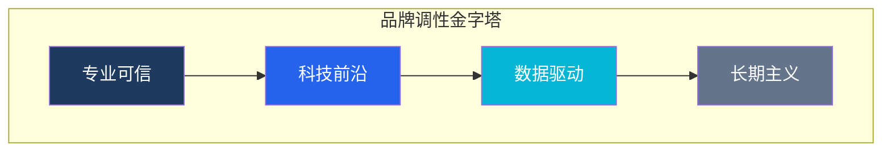
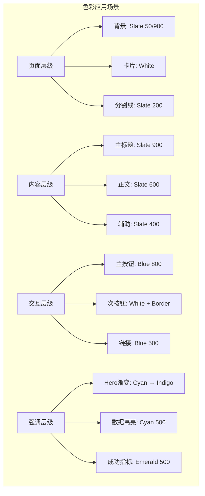

# 彼励扶（BelieveBoy）UI/UX 设计系统

> **版本**: 1.0  
> **日期**: 2026-01-30  
> **设计目标**: 商务科技风格 · 专业可信 · AI赋能

---

## 📋 目录

1. [设计原则](#一-设计原则)
2. [色彩系统](#二-色彩系统)
3. [字体系统](#三-字体系统)
4. [间距系统](#四-间距系统)
5. [组件规范](#五-组件规范)
6. [动画规范](#六-动画规范)
7. [页面布局](#七-页面布局)
8. [响应式规范](#八-响应式规范)

---

## 一、设计原则

### 1.1 品牌调性



### 1.2 设计关键词

| 关键词 | 视觉表现 | 应用场景 |
|--------|----------|----------|
| **专业** | 简洁布局、清晰层级 | 整体页面架构 |
| **科技** | 渐变光效、数据可视化 | Hero区、AI展示 |
| **可信** | 稳重色彩、充足留白 | 案例、定价页 |
| **活力** | 动态效果、微交互 | 按钮、卡片悬停 |

### 1.3 设计语言

- **极简主义**: 去除冗余装饰，内容优先
- **数据可视化**: 用图表、数字展示专业实力
- **科技光效**: 微妙的渐变和光晕效果体现AI属性
- **有机曲线**: 柔和圆角，平衡科技的冰冷感

---

## 二、色彩系统

### 2.1 主色调

```
┌─────────────────────────────────────────────────────────────────┐
│                        主色调体系                                 │
├─────────────────────────────────────────────────────────────────┤
│                                                                 │
│  Primary Dark      Primary         Primary Light               │
│  ┌─────────┐      ┌─────────┐      ┌─────────┐                 │
│  │#0f172a  │ ───▶ │#1e40af  │ ───▶ │#3b82f6  │                 │
│  │Slate 900│      │Blue 800 │      │Blue 500 │                 │
│  └─────────┘      └─────────┘      └─────────┘                 │
│     深色背景        品牌主色         强调高亮                     │
│                                                                 │
└─────────────────────────────────────────────────────────────────┘
```

#### 主色板

| 角色 | 色值 | Tailwind | 使用场景 |
|------|------|----------|----------|
| **Primary Dark** | `#0f172a` | `slate-900` | 深色背景、页脚、导航栏 |
| **Primary** | `#1e40af` | `blue-800` | 品牌色、主按钮、关键强调 |
| **Primary Light** | `#3b82f6` | `blue-500` | 链接、悬停状态、图标 |
| **Primary Lighter** | `#60a5fa` | `blue-400` | 次级强调、装饰元素 |

### 2.2 辅助色（科技感）

```
┌─────────────────────────────────────────────────────────────────┐
│                        科技辅助色系                               │
├─────────────────────────────────────────────────────────────────┤
│                                                                 │
│  Cyan           Indigo          Violet                         │
│  ┌─────────┐   ┌─────────┐   ┌─────────┐                       │
│  │#06b6d4  │   │#6366f1  │   │#8b5cf6  │                       │
│  │Cyan 500 │   │Indigo 500│   │Violet 500│                      │
│  └─────────┘   └─────────┘   └─────────┘                       │
│   AI/数据        创新/前瞻       品质/高端                       │
│                                                                 │
│  渐变组合: Cyan → Blue → Indigo                                  │
│  #06b6d4 → #3b82f6 → #6366f1                                    │
│                                                                 │
└─────────────────────────────────────────────────────────────────┘
```

#### 辅助色板

| 角色 | 色值 | Tailwind | 使用场景 |
|------|------|----------|----------|
| **Accent Cyan** | `#06b6d4` | `cyan-500` | AI元素、数据高亮、科技装饰 |
| **Accent Indigo** | `#6366f1` | `indigo-500` | 创新模块、前瞻内容 |
| **Accent Violet** | `#8b5cf6` | `violet-500` | 高端服务、VIP内容 |
| **Gradient Start** | `#06b6d4` | `cyan-500` | 渐变起始色 |
| **Gradient End** | `#6366f1` | `indigo-500` | 渐变结束色 |

### 2.3 中性色

```
┌─────────────────────────────────────────────────────────────────┐
│                        中性色体系                                 │
├─────────────────────────────────────────────────────────────────┤
│                                                                 │
│  Background      Surface       Border        Text               │
│  ┌─────────┐   ┌─────────┐   ┌─────────┐   ┌─────────┐         │
│  │#f8fafc  │   │#ffffff  │   │#e2e8f0  │   │#0f172a  │         │
│  │Slate 50 │   │White    │   │Slate 200│   │Slate 900│         │
│  └─────────┘   └─────────┘   └─────────┘   └─────────┘         │
│   页面背景        卡片背景       边框分割        主要文字         │
│                                                                 │
│  ┌─────────┐   ┌─────────┐   ┌─────────┐                       │
│  │#f1f5f9  │   │#64748b  │   │#94a3b8  │                       │
│  │Slate 100│   │Slate 500│   │Slate 400│                       │
│  └─────────┘   └─────────┘   └─────────┘                       │
│   次级背景        次级文字       辅助文字                         │
│                                                                 │
└─────────────────────────────────────────────────────────────────┘
```

#### 中性色板

| 角色 | 色值 | Tailwind | 使用场景 |
|------|------|----------|----------|
| **Background** | `#f8fafc` | `slate-50` | 页面背景、浅色区域 |
| **Surface** | `#ffffff` | `white` | 卡片、弹窗、输入框 |
| **Border** | `#e2e8f0` | `slate-200` | 边框、分割线 |
| **Border Hover** | `#cbd5e1` | `slate-300` | 边框悬停状态 |
| **Text Primary** | `#0f172a` | `slate-900` | 主标题、重要文字 |
| **Text Secondary** | `#475569` | `slate-600` | 正文、描述文字 |
| **Text Tertiary** | `#94a3b8` | `slate-400` | 辅助文字、占位符 |
| **Text Inverse** | `#f8fafc` | `slate-50` | 深色背景上的文字 |

### 2.4 语义色

```
┌─────────────────────────────────────────────────────────────────┐
│                        语义色彩系统                               │
├─────────────────────────────────────────────────────────────────┤
│                                                                 │
│   Success           Warning           Error           Info      │
│   ┌─────────┐      ┌─────────┐      ┌─────────┐    ┌─────────┐ │
│   │#10b981  │      │#f59e0b  │      │#ef4444  │    │#0ea5e9  │ │
│   │Emerald  │      │Amber    │      │Red      │    │Sky      │ │
│   │500      │      │500      │      │500      │    │500      │ │
│   └─────────┘      └─────────┘      └─────────┘    └─────────┘ │
│    成功/增长        警告/注意         错误/失败      信息/提示    │
│                                                                 │
└─────────────────────────────────────────────────────────────────┘
```

#### 语义色板

| 角色 | 主色 | 浅色背景 | 深色文字 | 使用场景 |
|------|------|----------|----------|----------|
| **Success** | `#10b981` | `#d1fae5` | `#065f46` | 增长数据、成功状态、正向指标 |
| **Warning** | `#f59e0b` | `#fef3c7` | `#92400e` | 注意事项、提醒、警示 |
| **Error** | `#ef4444` | `#fee2e2` | `#991b1b` | 错误提示、验证失败 |
| **Info** | `#0ea5e9` | `#e0f2fe` | `#075985` | 信息提示、帮助说明 |

### 2.5 色彩使用场景



#### 色彩组合规范

| 场景 | 背景 | 文字 | 强调 | 示例 |
|------|------|------|------|------|
| **浅色页面** | `slate-50` | `slate-900` | `blue-600` | 大部分内容页 |
| **深色Hero** | `slate-900` | `white` | `cyan-400` | 首页顶部 |
| **卡片** | `white` | `slate-900` | `blue-600` | 服务卡片、案例卡片 |
| **成功展示** | `emerald-50` | `emerald-900` | `emerald-500` | 增长数据 |
| **CTA区域** | `blue-900` | `white` | `cyan-400` | 行动召唤 |

### 2.6 渐变规范

```css
/* 主渐变 - 科技感 */
--gradient-primary: linear-gradient(135deg, #06b6d4 0%, #3b82f6 50%, #6366f1 100%);

/* 深色渐变 - Hero背景 */
--gradient-dark: linear-gradient(180deg, #0f172a 0%, #1e293b 100%);

/* 浅色渐变 - 卡片装饰 */
--gradient-light: linear-gradient(135deg, #f0f9ff 0%, #e0f2fe 100%);

/* 成功渐变 - 数据展示 */
--gradient-success: linear-gradient(135deg, #10b981 0%, #34d399 100%);
```

---

## 三、字体系统

### 3.1 字体选择

```
┌─────────────────────────────────────────────────────────────────┐
│                        字体体系                                   │
├─────────────────────────────────────────────────────────────────┤
│                                                                 │
│  中文字体                                                        │
│  ┌──────────────────────────────────────────────────────┐      │
│  │  思源黑体 Source Han Sans / Noto Sans SC              │      │
│  │  - 现代几何风格，适合科技商务                          │      │
│  │  - 字重丰富，从 Light 到 Heavy                        │      │
│  │  - 开源免费，加载稳定                                  │      │
│  └──────────────────────────────────────────────────────┘      │
│                                                                 │
│  英文字体                                                        │
│  ┌──────────────────────────────────────────────────────┐      │
│  │  Inter                                                │      │
│  │  - 专为屏幕显示优化                                    │      │
│  │  - 优秀的数字显示效果                                  │      │
│  │  - 与中文搭配协调                                      │      │
│  └──────────────────────────────────────────────────────┘      │
│                                                                 │
│  备用字体栈                                                      │
│  font-family: 'Inter', 'Noto Sans SC', 'PingFang SC',           │
│               'Microsoft YaHei', sans-serif;                    │
│                                                                 │
└─────────────────────────────────────────────────────────────────┘
```

### 3.2 字号层级

| 层级 | 字号 | 字重 | 行高 | 字间距 | 使用场景 |
|------|------|------|------|--------|----------|
| **Hero** | 48px / 3rem | 700 | 1.1 | -0.02em | 首页大标题 |
| **H1** | 40px / 2.5rem | 700 | 1.2 | -0.02em | 页面主标题 |
| **H2** | 32px / 2rem | 600 | 1.25 | -0.01em | Section标题 |
| **H3** | 24px / 1.5rem | 600 | 1.3 | 0 | 卡片标题 |
| **H4** | 20px / 1.25rem | 600 | 1.4 | 0 | 小标题 |
| **Body Large** | 18px / 1.125rem | 400 | 1.6 | 0 | 引导段落 |
| **Body** | 16px / 1rem | 400 | 1.6 | 0 | 正文内容 |
| **Body Small** | 14px / 0.875rem | 400 | 1.5 | 0 | 辅助说明 |
| **Caption** | 12px / 0.75rem | 500 | 1.4 | 0.02em | 标签、时间 |

### 3.3 响应式字号

| 层级 | 桌面端 | 平板端 | 移动端 |
|------|--------|--------|--------|
| **Hero** | 48px | 40px | 32px |
| **H1** | 40px | 36px | 28px |
| **H2** | 32px | 28px | 24px |
| **H3** | 24px | 22px | 20px |
| **Body** | 16px | 16px | 15px |

### 3.4 字重规范

| 字重 | 数值 | 使用场景 |
|------|------|----------|
| **Light** | 300 | 装饰性大数字 |
| **Regular** | 400 | 正文、描述 |
| **Medium** | 500 | 按钮文字、标签 |
| **Semibold** | 600 | 小标题、强调 |
| **Bold** | 700 | 大标题、关键数据 |

### 3.5 字体样式示例

```css
/* Hero 标题 */
.text-hero {
  font-size: 3rem;
  font-weight: 700;
  line-height: 1.1;
  letter-spacing: -0.02em;
  color: #0f172a;
}

/* 正文 */
.text-body {
  font-size: 1rem;
  font-weight: 400;
  line-height: 1.6;
  color: #475569;
}

/* 数据数字 */
.text-stat {
  font-size: 3rem;
  font-weight: 700;
  line-height: 1;
  letter-spacing: -0.03em;
  font-feature-settings: 'tnum';  /* 等宽数字 */
}
```

---

## 四、间距系统

### 4.1 间距基准

基于 **4px** 基准单位建立间距系统：

| 名称 | 数值 | 使用场景 |
|------|------|----------|
| **space-1** | 4px | 图标间距、紧凑内边距 |
| **space-2** | 8px | 行内元素间距、小间隙 |
| **space-3** | 12px | 表单元素间距 |
| **space-4** | 16px | 默认间距、卡片内边距 |
| **space-5** | 20px | 组件间距 |
| **space-6** | 24px | Section内部间距 |
| **space-8** | 32px | 卡片间距 |
| **space-10** | 40px | 大组件间距 |
| **space-12** | 48px | Section标题与内容间距 |
| **space-16** | 64px | Section之间间距 |
| **space-20** | 80px | 大型Section间距 |
| **space-24** | 96px | 页面主要区域间距 |

### 4.2 页面边距

| 断点 | 边距 | 最大宽度 |
|------|------|----------|
| **桌面端** (>1280px) | 48px | 1280px |
| **大平板** (1024-1280px) | 32px | 100% |
| **平板** (768-1024px) | 24px | 100% |
| **移动端** (<768px) | 16px | 100% |

### 4.3 Section间距

```
┌─────────────────────────────────────────────────────────────────┐
│                        Section间距规范                           │
├─────────────────────────────────────────────────────────────────┤
│                                                                 │
│  桌面端 Section Padding: 96px 上下 (py-24)                        │
│                                                                 │
│  ┌─────────────────────────────────────────────────────────┐   │
│  │                                                         │   │
│  │    ┌───────────────────────────────────────────────┐   │   │
│  │    │                                               │   │   │
│  │    │              Section Content                  │   │   │
│  │    │                                               │   │   │
│  │    └───────────────────────────────────────────────┘   │   │
│  │                                                         │   │
│  └─────────────────────────────────────────────────────────┘   │
│                                                                 │
│  相邻Section间距: 0 (通过padding叠加)                             │
│  不同类型Section区分: 背景色变化                                   │
│                                                                 │
└─────────────────────────────────────────────────────────────────┘
```

#### Section间距规范

| 场景 | 桌面端 | 平板端 | 移动端 |
|------|--------|--------|--------|
| **大型Section** | 96px | 64px | 48px |
| **中型Section** | 64px | 48px | 32px |
| **紧凑Section** | 48px | 32px | 24px |
| **Section标题→内容** | 48px | 40px | 32px |

### 4.4 组件内间距

| 组件 | 内边距 | 元素间距 |
|------|--------|----------|
| **卡片** | 24px | 16px |
| **按钮** | 12px 24px | - |
| **小按钮** | 8px 16px | - |
| **输入框** | 12px 16px | - |
| **标签/徽章** | 4px 12px | - |
| **导航项** | 8px 16px | 8px |

### 4.5 Grid系统

```
┌─────────────────────────────────────────────────────────────────┐
│                        Grid 系统                                 │
├─────────────────────────────────────────────────────────────────┤
│                                                                 │
│  桌面端 (≥1280px): 12列                                          │
│  ┌────┬────┬────┬────┬────┬────┬────┬────┬────┬────┬────┬────┐ │
│  │ 1  │ 2  │ 3  │ 4  │ 5  │ 6  │ 7  │ 8  │ 9  │ 10 │ 11 │ 12 │ │
│  └────┴────┴────┴────┴────┴────┴────┴────┴────┴────┴────┴────┘ │
│  Gap: 32px                                                      │
│                                                                 │
│  平板端 (768-1279px): 8列                                        │
│  ┌────┬────┬────┬────┬────┬────┬────┬────┐                     │
│  │ 1  │ 2  │ 3  │ 4  │ 5  │ 6  │ 7  │ 8  │                     │
│  └────┴────┴────┴────┴────┴────┴────┴────┘                     │
│  Gap: 24px                                                      │
│                                                                 │
│  移动端 (<768px): 4列                                            │
│  ┌────┬────┬────┬────┐                                          │
│  │ 1  │ 2  │ 3  │ 4  │                                          │
│  └────┴────┴────┴────┘                                          │
│  Gap: 16px                                                      │
│                                                                 │
└─────────────────────────────────────────────────────────────────┘
```

### 4.6 断点定义

| 断点名 | 范围 | 容器最大宽度 |
|--------|------|--------------|
| **sm** | ≥640px | 100% |
| **md** | ≥768px | 100% |
| **lg** | ≥1024px | 100% |
| **xl** | ≥1280px | 1280px |
| **2xl** | ≥1536px | 1440px |

---

## 五、组件规范

### 5.1 按钮样式

```
┌─────────────────────────────────────────────────────────────────┐
│                        按钮组件                                  │
├─────────────────────────────────────────────────────────────────┤
│                                                                 │
│  主按钮 (Primary)                                                │
│  ┌─────────────────────────────────┐                           │
│  │  背景: Blue 800                  │                           │
│  │  文字: White                     │                           │
│  │  圆角: 8px (rounded-lg)          │                           │
│  │  内边距: 12px 24px               │                           │
│  │  字体: 500 16px                  │                           │
│  │  悬停: Blue 700 + shadow-lg      │                           │
│  └─────────────────────────────────┘                           │
│                                                                 │
│  次按钮 (Secondary)                                              │
│  ┌─────────────────────────────────┐                           │
│  │  背景: White                     │                           │
│  │  边框: 1px Slate 300             │                           │
│  │  文字: Slate 700                 │                           │
│  │  悬停: Slate 50 背景             │                           │
│  └─────────────────────────────────┘                           │
│                                                                 │
│  幽灵按钮 (Ghost)                                                │
│  ┌─────────────────────────────────┐                           │
│  │  背景: Transparent               │                           │
│  │  文字: Blue 600                  │                           │
│  │  悬停: Blue 50 背景              │                           │
│  └─────────────────────────────────┘                           │
│                                                                 │
│  CTA按钮 (Hero)                                                  │
│  ┌─────────────────────────────────┐                           │
│  │  背景: 渐变 Cyan → Blue          │                           │
│  │  文字: White                     │                           │
│  │  阴影: glow效果                  │                           │
│  │  悬停: 亮度提升 + 阴影增强        │                           │
│  └─────────────────────────────────┘                           │
│                                                                 │
└─────────────────────────────────────────────────────────────────┘
```

#### 按钮规格表

| 类型 | 背景 | 文字 | 边框 | 圆角 | 阴影 | 悬停效果 |
|------|------|------|------|------|------|----------|
| **Primary** | `blue-800` | white | none | 8px | none | `blue-700` + `shadow-lg` |
| **Secondary** | white | `slate-700` | 1px `slate-300` | 8px | none | `slate-50` |
| **Ghost** | transparent | `blue-600` | none | 8px | none | `blue-50` |
| **CTA** | gradient | white | none | 12px | glow | brightness(1.1) |
| **Danger** | `red-600` | white | none | 8px | none | `red-700` |
| **Success** | `emerald-600` | white | none | 8px | none | `emerald-700` |

#### 按钮尺寸

| 尺寸 | 内边距 | 字号 | 用途 |
|------|--------|------|------|
| **Small** | 8px 16px | 14px | 表格内、紧凑布局 |
| **Medium** | 12px 24px | 16px | 默认尺寸 |
| **Large** | 16px 32px | 18px | Hero区域、CTA |
| **Icon** | 12px | - | 图标按钮 |

### 5.2 卡片样式

```
┌─────────────────────────────────────────────────────────────────┐
│                        卡片组件                                  │
├─────────────────────────────────────────────────────────────────┤
│                                                                 │
│  服务卡片                                                        │
│  ┌─────────────────────────────────────────┐                   │
│  │  ┌─────┐                                │                   │
│  │  │图标 │  服务名称                        │                   │
│  │  └─────┘                                │                   │
│  │  ─────────────────────────────────────  │                   │
│  │  服务描述文字内容...                      │                   │
│  │                                         │                   │
│  │  [了解更多 →]                            │                   │
│  └─────────────────────────────────────────┘                   │
│  背景: White, 圆角: 16px, 阴影: shadow-md                        │
│  悬停: 上移 -4px, 阴影: shadow-xl, 边框: Blue 200                │
│                                                                 │
│  案例卡片                                                        │
│  ┌─────────────────────────────────────────┐                   │
│  │  ┌─────────────────────────────────┐    │                   │
│  │  │                                 │    │                   │
│  │  │         案例图片                 │    │                   │
│  │  │                                 │    │                   │
│  │  └─────────────────────────────────┘    │                   │
│  │  案例名称                                │                   │
│  │  ┌────────┐ ┌────────┐ ┌────────┐      │                   │
│  │  │ +180%  │ │ -23%   │ │ TOP 3  │      │                   │
│  │  │ 增长   │ │ ACOS   │ │ 排名   │      │                   │
│  │  └────────┘ └────────┘ └────────┘      │                   │
│  └─────────────────────────────────────────┘                   │
│                                                                 │
│  定价卡片                                                        │
│  ┌─────────────────────────────────────────┐                   │
│  │  推荐标签 (Featured)                    │                   │
│  │  方案名称              ¥88,000/月       │                   │
│  │  ─────────────────────────────────────  │                   │
│  │  ✓ 功能点 1                             │                   │
│  │  ✓ 功能点 2                             │                   │
│  │  ✓ 功能点 3                             │                   │
│  │                                         │                   │
│  │  [选择此方案]                           │                   │
│  └─────────────────────────────────────────┘                   │
│  Featured: 边框 Blue 500, 阴影 glow效果                          │
│                                                                 │
└─────────────────────────────────────────────────────────────────┘
```

#### 卡片规格表

| 类型 | 背景 | 圆角 | 阴影 | 内边距 | 悬停效果 |
|------|------|------|------|--------|----------|
| **服务卡片** | white | 16px | `shadow-md` | 24px | `shadow-xl` + `translateY(-4px)` |
| **案例卡片** | white | 16px | `shadow-md` | 0 | `shadow-xl` + 图片放大 |
| **定价卡片** | white | 16px | `shadow-md` | 32px | `shadow-xl` |
| **定价卡片 Featured** | white | 16px | `shadow-lg` + border | 32px | `shadow-2xl` |
| **统计卡片** | `slate-900` | 16px | none | 24px | `shadow-lg` |
| **博客卡片** | white | 12px | `shadow-sm` | 0 | `shadow-md` |

### 5.3 输入框样式

```
┌─────────────────────────────────────────────────────────────────┐
│                        输入框组件                                │
├─────────────────────────────────────────────────────────────────┤
│                                                                 │
│  默认状态                                                        │
│  ┌─────────────────────────────────────────┐                   │
│  │  标签                                    │                   │
│  │  ┌─────────────────────────────────┐    │                   │
│  │  │ 占位符文字...                    │    │                   │
│  │  └─────────────────────────────────┘    │                   │
│  └─────────────────────────────────────────┘                   │
│  边框: 1px Slate 300, 圆角: 8px                                  │
│                                                                 │
│  聚焦状态                                                        │
│  ┌─────────────────────────────────────────┐                   │
│  │  标签                                    │                   │
│  │  ┌─────────────────────────────────┐    │                   │
│  │  │ 输入内容...  │                  │    │                   │
│  │  └─────────────────────────────────┘    │                   │
│  └─────────────────────────────────────────┘                   │
│  边框: 2px Blue 500, 阴影: 0 0 0 3px Blue 100                   │
│                                                                 │
│  错误状态                                                        │
│  ┌─────────────────────────────────────────┐                   │
│  │  标签                                    │                   │
│  │  ┌─────────────────────────────────┐    │                   │
│  │  │ 错误内容...                     │ ⚠️ │                   │
│  │  └─────────────────────────────────┘    │                   │
│  │  错误提示信息                            │                   │
│  └─────────────────────────────────────────┘                   │
│  边框: 2px Red 500, 文字: Red 600                                │
│                                                                 │
└─────────────────────────────────────────────────────────────────┘
```

#### 输入框规格表

| 状态 | 边框 | 背景 | 圆角 | 阴影 | 文字颜色 |
|------|------|------|------|------|----------|
| **Default** | 1px `slate-300` | white | 8px | none | `slate-900` |
| **Hover** | 1px `slate-400` | white | 8px | none | `slate-900` |
| **Focus** | 2px `blue-500` | white | 8px | `0 0 0 3px blue-100` | `slate-900` |
| **Error** | 2px `red-500` | `red-50` | 8px | none | `red-900` |
| **Disabled** | 1px `slate-200` | `slate-100` | 8px | none | `slate-400` |

### 5.4 导航栏样式

```
┌─────────────────────────────────────────────────────────────────┐
│                        导航栏组件                                │
├─────────────────────────────────────────────────────────────────┤
│                                                                 │
│  桌面端导航                                                      │
│  ┌─────────────────────────────────────────────────────────┐   │
│  │  [Logo]    首页  服务  AI赋能  案例  定价    [联系我们]  │   │
│  └─────────────────────────────────────────────────────────┘   │
│  高度: 72px, 背景: White/Slate 900, 阴影: shadow-sm             │
│                                                                 │
│  滚动后导航                                                      │
│  ┌─────────────────────────────────────────────────────────┐   │
│  │  [Logo]    首页  服务  AI赋能  案例  定价    [联系我们]  │   │
│  └─────────────────────────────────────────────────────────┘   │
│  背景: White/半透明模糊, 阴影: shadow-md                         │
│                                                                 │
│  移动端导航                                                      │
│  ┌─────────────────────────┐                                   │
│  │  [Logo]           [☰]   │                                   │
│  └─────────────────────────┘                                   │
│  点击展开:                                                      │
│  ┌─────────────────────────┐                                   │
│  │  [Logo]           [✕]   │                                   │
│  │  ─────────────────────  │                                   │
│  │  首页                    │                                   │
│  │  服务                    │                                   │
│  │  AI赋能                  │                                   │
│  │  案例                    │                                   │
│  │  定价                    │                                   │
│  │  [联系我们]              │                                   │
│  └─────────────────────────┘                                   │
│                                                                 │
└─────────────────────────────────────────────────────────────────┘
```

#### 导航栏规格表

| 属性 | 桌面端 | 移动端 |
|------|--------|--------|
| **高度** | 72px | 64px |
| **背景** | white / `slate-900` | white / `slate-900` |
| **内边距** | 0 48px | 0 16px |
| **Logo高度** | 32px | 28px |
| **链接间距** | 32px | 0 (垂直堆叠) |
| **下拉菜单** | 圆角12px, 阴影xl | 全屏覆盖 |

### 5.5 标签和徽章

```
┌─────────────────────────────────────────────────────────────────┐
│                        标签/徽章组件                             │
├─────────────────────────────────────────────────────────────────┤
│                                                                 │
│  状态徽章                                                        │
│  ┌─────────┐ ┌─────────┐ ┌─────────┐ ┌─────────┐               │
│  │ ● 进行中 │ │ ● 已完成 │ │ ● 已暂停 │ │ ● 已取消 │               │
│  └─────────┘ └─────────┘ └─────────┘ └─────────┘               │
│  颜色: Blue / Emerald / Amber / Gray                            │
│                                                                 │
│  分类标签                                                        │
│  ┌─────────┐ ┌─────────┐ ┌─────────┐                           │
│  │ 亚马逊   │ │ 独立站   │ │ AI技术   │                           │
│  └─────────┘ └─────────┘ └─────────┘                           │
│  背景: Slate 100, 文字: Slate 700                                │
│                                                                 │
│  强调标签                                                        │
│  ┌─────────┐ ┌─────────┐                                       │
│  │ 推荐    │ │ 热门    │                                       │
│  └─────────┘ └─────────┘                                       │
│  背景: Blue 100, 文字: Blue 700, 边框: Blue 200                  │
│                                                                 │
│  数字徽章                                                        │
│  ┌─────┐                                                       │
│  │ 99+ │                                                       │
│  └─────┘                                                       │
│  背景: Red 500, 文字: White, 圆角全角                            │
│                                                                 │
└─────────────────────────────────────────────────────────────────┘
```

#### 徽章规格表

| 类型 | 背景 | 文字 | 圆角 | 内边距 |
|------|------|------|------|--------|
| **Status** | 对应色彩100 | 对应色彩700 | 9999px | 4px 12px |
| **Category** | `slate-100` | `slate-700` | 6px | 4px 12px |
| **Featured** | `blue-100` | `blue-700` | 6px | 4px 12px |
| **Number** | `red-500` | white | 9999px | 2px 6px |

---

## 六、动画规范

### 6.1 动画原则

- **目的性**: 每个动画都应有明确目的，引导用户注意力
- **克制性**: 避免过度动画，保持专业感
- **流畅性**: 60fps流畅体验，无卡顿
- **可访问性**: 支持 `prefers-reduced-motion`

### 6.2 动画时长

| 类型 | 时长 | 用途 |
|------|------|------|
| **即时** | 0ms | 无动画，直接响应 |
| **快速** | 150ms | 微交互、hover状态 |
| **正常** | 300ms | 标准过渡、状态切换 |
| **缓慢** | 500ms | 重要过渡、页面切换 |
| **展示** | 800ms | Hero动画、入场效果 |

### 6.3 缓动函数

```css
/* 标准缓动 */
--ease-default: cubic-bezier(0.4, 0, 0.2, 1);

/* 进入 */
--ease-in: cubic-bezier(0.4, 0, 1, 1);

/* 退出 */
--ease-out: cubic-bezier(0, 0, 0.2, 1);

/* 弹性 */
--ease-spring: cubic-bezier(0.34, 1.56, 0.64, 1);

/* 平滑 */
--ease-smooth: cubic-bezier(0.65, 0, 0.35, 1);
```

### 6.4 页面过渡

```
┌─────────────────────────────────────────────────────────────────┐
│                        页面过渡效果                              │
├─────────────────────────────────────────────────────────────────┤
│                                                                 │
│  页面加载序列                                                    │
│  1. 骨架屏显示 (0ms)                                             │
│  2. 内容淡入 (300ms, ease-out)                                   │
│  3. 各Section依次进入 (stagger 100ms)                            │
│                                                                 │
│  页面切换 (SPA模式)                                              │
│  1. 当前页面淡出 (200ms)                                         │
│  2. 新页面淡入 (300ms)                                           │
│                                                                 │
└─────────────────────────────────────────────────────────────────┘
```

### 6.5 滚动触发动画

```
┌─────────────────────────────────────────────────────────────────┐
│                        滚动触发动画                              │
├─────────────────────────────────────────────────────────────────┤
│                                                                 │
│  Fade In (淡入)                                                  │
│  初始: opacity: 0, translateY: 20px                             │
│  结束: opacity: 1, translateY: 0                                │
│  时长: 600ms, 缓动: ease-out                                    │
│                                                                 │
│  Slide Up (上滑)                                                 │
│  初始: opacity: 0, translateY: 40px                             │
│  结束: opacity: 1, translateY: 0                                │
│  时长: 700ms, 缓动: cubic-bezier(0.22, 1, 0.36, 1)              │
│                                                                 │
│  Scale In (缩放)                                                 │
│  初始: opacity: 0, scale: 0.95                                  │
│  结束: opacity: 1, scale: 1                                     │
│  时长: 500ms, 缓动: ease-out                                    │
│                                                                 │
│  Stagger (交错)                                                  │
│  子元素依次进入，间隔: 100ms                                     │
│  用于: 卡片列表、特性展示                                        │
│                                                                 │
│  Counter (数字增长)                                              │
│  从0增长到目标值                                                 │
│  时长: 2000ms, 缓动: ease-out                                   │
│  用于: 数据统计展示                                              │
│                                                                 │
└─────────────────────────────────────────────────────────────────┘
```

#### 滚动动画配置

| 动画类型 | 初始状态 | 结束状态 | 时长 | 缓动 | 触发点 |
|----------|----------|----------|------|------|--------|
| **fade-in** | `opacity: 0` | `opacity: 1` | 600ms | ease-out | 元素进入视口20% |
| **slide-up** | `opacity: 0, translateY: 40px` | `opacity: 1, translateY: 0` | 700ms | `cubic-bezier(0.22, 1, 0.36, 1)` | 元素进入视口20% |
| **scale-in** | `opacity: 0, scale: 0.95` | `opacity: 1, scale: 1` | 500ms | ease-out | 元素进入视口20% |
| **stagger** | 同slide-up | 同slide-up | 700ms | ease-out | 父元素进入视口，子元素间隔100ms |

### 6.6 悬停交互

```
┌─────────────────────────────────────────────────────────────────┐
│                        悬停交互效果                              │
├─────────────────────────────────────────────────────────────────┤
│                                                                 │
│  按钮悬停                                                        │
│  - 背景色变亮                                                    │
│  - 阴影出现 (shadow-md → shadow-lg)                              │
│  - 轻微上移 (translateY: -1px)                                   │
│  - 时长: 200ms                                                   │
│                                                                 │
│  卡片悬停                                                        │
│  - 上移 (translateY: -4px)                                       │
│  - 阴影增强 (shadow-md → shadow-xl)                              │
│  - 边框变色 (可选)                                               │
│  - 时长: 300ms, 缓动: ease-out                                   │
│                                                                 │
│  链接悬停                                                        │
│  - 颜色变亮                                                      │
│  - 下划线出现 (width: 0 → 100%)                                  │
│  - 时长: 200ms                                                   │
│                                                                 │
│  图片悬停                                                        │
│  - 轻微放大 (scale: 1.05)                                        │
│  - 时长: 400ms, 缓动: ease-out                                   │
│                                                                 │
└─────────────────────────────────────────────────────────────────┘
```

#### 悬停动画配置

| 元素 | 属性变化 | 时长 | 缓动 |
|------|----------|------|------|
| **按钮** | `shadow` + `translateY(-1px)` | 200ms | ease-out |
| **卡片** | `shadow-xl` + `translateY(-4px)` | 300ms | ease-out |
| **链接** | `color` + `underline` | 200ms | ease-out |
| **图片** | `scale(1.05)` | 400ms | ease-out |
| **图标** | `translateX(4px)` | 200ms | ease-out |

### 6.7 特殊动画

```
┌─────────────────────────────────────────────────────────────────┐
│                        特殊动画效果                              │
├─────────────────────────────────────────────────────────────────┤
│                                                                 │
│  渐变文字动画 (Gradient Text)                                    │
│  background: linear-gradient(...)                                │
│  background-size: 200% 200%                                      │
│  animation: gradient-shift 8s ease infinite                      │
│                                                                 │
│  粒子背景 (Particle Background)                                  │
│  - 轻微浮动粒子                                                  │
│  - 跟随鼠标轻微移动                                              │
│  - 低透明度，不干扰内容                                          │
│  - 用于: Hero区域                                                │
│                                                                 │
│  脉冲效果 (Pulse)                                                │
│  animation: pulse 2s ease-in-out infinite                        │
│  用于: 实时状态指示器、推荐标签                                  │
│                                                                 │
│  数字增长动画 (Count Up)                                         │
│  从0滚动到目标数字                                               │
│  时长: 2000ms                                                    │
│  用于: 统计数据展示                                              │
│                                                                 │
└─────────────────────────────────────────────────────────────────┘
```

---

## 七、页面布局

### 7.1 首页布局结构

```
┌─────────────────────────────────────────────────────────────────┐
│                        首页布局                                  │
├─────────────────────────────────────────────────────────────────┤
│                                                                 │
│  ┌─────────────────────────────────────────────────────────┐   │
│  │  Navigation Bar (固定顶部)                               │   │
│  └─────────────────────────────────────────────────────────┘   │
│                                                                 │
│  ┌─────────────────────────────────────────────────────────┐   │
│  │                                                         │   │
│  │  HERO SECTION                                           │   │
│  │  ┌─────────────────────────────────────────────────┐    │   │
│  │  │  让中国品牌闪耀全球                                │    │   │
│  │  │  专业跨境电商运营 × AI智能驱动                      │    │   │
│  │  │                                                 │    │   │
│  │  │  [立即咨询]  [了解服务]                           │    │   │
│  │  └─────────────────────────────────────────────────┘    │   │
│  │  背景: 深色渐变 + 粒子效果                               │   │
│  │  高度: 100vh (首屏)                                     │   │
│  │                                                         │   │
│  └─────────────────────────────────────────────────────────┘   │
│                                                                 │
│  ┌─────────────────────────────────────────────────────────┐   │
│  │  LOGOS/TRUST SECTION                                    │   │
│  │  合作平台logo展示                                        │   │
│  └─────────────────────────────────────────────────────────┘   │
│                                                                 │
│  ┌─────────────────────────────────────────────────────────┐   │
│  │  WHY US SECTION (为什么选择我们)                         │   │
│  │  ┌──────────┐ ┌──────────┐ ┌──────────┐ ┌──────────┐   │   │
│  │  │ 全生态   │ │ AI深度   │ │ 结果导向 │ │ 长期主义 │   │   │
│  │  │ 服务能力 │ │ 赋能     │ │ 合作     │ │ 理念     │   │   │
│  │  └──────────┘ └──────────┘ └──────────┘ └──────────┘   │   │
│  └─────────────────────────────────────────────────────────┘   │
│                                                                 │
│  ┌─────────────────────────────────────────────────────────┐   │
│  │  SERVICES SECTION (核心服务)                             │   │
│  │  4个服务模块卡片展示                                     │   │
│  └─────────────────────────────────────────────────────────┘   │
│                                                                 │
│  ┌─────────────────────────────────────────────────────────┐   │
│  │  AI SHOWCASE SECTION (AI赋能)                            │   │
│  │  左侧: AI能力介绍                                        │   │
│  │  右侧: 数据可视化/代码展示                                │   │
│  └─────────────────────────────────────────────────────────┘   │
│                                                                 │
│  ┌─────────────────────────────────────────────────────────┐   │
│  │  STATS SECTION (数据证明)                                │   │
│  │  ┌──────┐ ┌──────┐ ┌──────┐ ┌──────┐                   │   │
│  │  │ 3年  │ │ 10个 │ │ 7个  │ │100M+ │                   │   │
│  │  └──────┘ └──────┘ └──────┘ └──────┘                   │   │
│  └─────────────────────────────────────────────────────────┘   │
│                                                                 │
│  ┌─────────────────────────────────────────────────────────┐   │
│  │  CASES SECTION (成功案例)                                │   │
│  │  3个精选案例卡片 + [查看更多]                             │   │
│  └─────────────────────────────────────────────────────────┘   │
│                                                                 │
│  ┌─────────────────────────────────────────────────────────┐   │
│  │  CTA SECTION (行动召唤)                                  │   │
│  │  背景: 蓝色渐变                                          │   │
│  │  [立即预约免费咨询]                                       │   │
│  └─────────────────────────────────────────────────────────┘   │
│                                                                 │
│  ┌─────────────────────────────────────────────────────────┐   │
│  │  BLOG SECTION (最新洞察)                                 │   │
│  │  最新3篇博客预览                                         │   │
│  └─────────────────────────────────────────────────────────┘   │
│                                                                 │
│  ┌─────────────────────────────────────────────────────────┐   │
│  │  FOOTER                                                  │   │
│  └─────────────────────────────────────────────────────────┘   │
│                                                                 │
└─────────────────────────────────────────────────────────────────┘
```

### 7.2 通用页面布局

```
┌─────────────────────────────────────────────────────────────────┐
│                        通用页面布局                              │
├─────────────────────────────────────────────────────────────────┤
│                                                                 │
│  ┌─────────────────────────────────────────────────────────┐   │
│  │  Navigation Bar                                          │   │
│  └─────────────────────────────────────────────────────────┘   │
│                                                                 │
│  ┌─────────────────────────────────────────────────────────┐   │
│  │  PAGE HEADER (页面标题区)                                │   │
│  │  ┌─────────────────────────────────────────────────┐    │   │
│  │  │  页面标题                                        │    │   │
│  │  │  简短描述文字...                                  │    │   │
│  │  └─────────────────────────────────────────────────┘    │   │
│  │  背景: 浅色 / 深色渐变                                  │   │
│  │  高度: 200-300px                                        │   │
│  └─────────────────────────────────────────────────────────┘   │
│                                                                 │
│  ┌─────────────────────────────────────────────────────────┐   │
│  │  MAIN CONTENT (主内容区)                                 │   │
│  │  ┌─────────────────────────────────────────────────┐    │   │
│  │  │                                                 │    │   │
│  │  │              页面具体内容                        │    │   │
│  │  │                                                 │    │   │
│  │  └─────────────────────────────────────────────────┘    │   │
│  │  最大宽度: 1280px, 居中                                 │   │
│  └─────────────────────────────────────────────────────────┘   │
│                                                                 │
│  ┌─────────────────────────────────────────────────────────┐   │
│  │  CTA SECTION (可选)                                      │   │
│  └─────────────────────────────────────────────────────────┘   │
│                                                                 │
│  ┌─────────────────────────────────────────────────────────┐   │
│  │  FOOTER                                                  │   │
│  └─────────────────────────────────────────────────────────┘   │
│                                                                 │
└─────────────────────────────────────────────────────────────────┘
```

### 7.3 各页面关键组件位置建议

| 页面 | 核心组件 | 推荐布局 |
|------|----------|----------|
| **首页** | Hero + 服务卡片 + 数据 + 案例 | 全宽Section + 居中容器 |
| **关于我们** | 公司介绍 + 理念 + 团队 | 图文左右交替 |
| **服务介绍** | 服务详情 + 流程图 + 能力清单 | 卡片网格 + 时间线 |
| **AI赋能** | AI能力 + 场景展示 + 数据可视化 | 分屏布局 + 代码风格 |
| **案例展示** | 案例卡片 + 数据亮点 + 客户评价 | 网格卡片 + 详情弹窗 |
| **定价方案** | 方案对比表 + 定价卡片 | 表格 + 卡片组合 |
| **联系我们** | 联系信息 + 表单 + 地图 | 左右分栏 |
| **博客列表** | 文章卡片 + 分类筛选 | 网格布局 + 侧边栏 |
| **博客详情** | 文章内容 + 作者 + 相关推荐 | 单栏阅读 + 相关文章 |

---

## 八、响应式规范

### 8.1 断点策略

| 断点 | 范围 | 主要调整 |
|------|------|----------|
| **Mobile** | < 640px | 单列布局，简化导航，堆叠内容 |
| **Tablet** | 640px - 1024px | 2列布局，调整字号，优化触控 |
| **Desktop** | 1024px - 1280px | 多列布局，完整导航 |
| **Large** | > 1280px | 最大容器宽度，优化阅读体验 |

### 8.2 响应式调整清单

| 元素 | 桌面端 | 平板端 | 移动端 |
|------|--------|--------|--------|
| **导航** | 水平链接 | 水平链接(简化) | 汉堡菜单 |
| **Hero标题** | 48px | 40px | 32px |
| **卡片列数** | 3-4列 | 2列 | 1列 |
| **Section间距** | 96px | 64px | 48px |
| **容器边距** | 48px | 24px | 16px |
| **按钮尺寸** | Medium | Medium | Large(触控) |
| **图片比例** | 16:9 | 16:9 | 4:3 |

### 8.3 移动端特殊处理

- **触摸目标**: 最小44x44px触控区域
- **字体**: 最小14px，确保可读性
- **间距**: 增加元素间距，避免误触
- **导航**: 全屏覆盖式菜单
- **图片**: 使用响应式图片，减少加载

---

## 九、设计资源

### 9.1 Tailwind配置参考

```javascript
// tailwind.config.ts 关键配置
export default {
  theme: {
    extend: {
      colors: {
        primary: {
          DEFAULT: '#1e40af',
          dark: '#0f172a',
          light: '#3b82f6',
        },
        accent: {
          cyan: '#06b6d4',
          indigo: '#6366f1',
        },
      },
      fontFamily: {
        sans: ['Inter', 'Noto Sans SC', 'sans-serif'],
      },
      animation: {
        'fade-in': 'fadeIn 0.6s ease-out',
        'slide-up': 'slideUp 0.7s cubic-bezier(0.22, 1, 0.36, 1)',
        'gradient': 'gradient 8s ease infinite',
      },
      keyframes: {
        fadeIn: {
          '0%': { opacity: '0' },
          '100%': { opacity: '1' },
        },
        slideUp: {
          '0%': { opacity: '0', transform: 'translateY(40px)' },
          '100%': { opacity: '1', transform: 'translateY(0)' },
        },
        gradient: {
          '0%, 100%': { backgroundPosition: '0% 50%' },
          '50%': { backgroundPosition: '100% 50%' },
        },
      },
    },
  },
}
```

### 9.2 CSS变量

```css
:root {
  /* 颜色 */
  --color-primary: #1e40af;
  --color-primary-dark: #0f172a;
  --color-accent-cyan: #06b6d4;
  --color-accent-indigo: #6366f1;
  
  /* 动画 */
  --duration-fast: 150ms;
  --duration-normal: 300ms;
  --duration-slow: 500ms;
  --ease-out: cubic-bezier(0, 0, 0.2, 1);
  --ease-spring: cubic-bezier(0.34, 1.56, 0.64, 1);
  
  /* 间距 */
  --space-section: 96px;
  --space-section-tablet: 64px;
  --space-section-mobile: 48px;
}
```

---

## 十、附录

### 10.1 设计检查清单

- [ ] 颜色对比度符合WCAG 2.1 AA标准
- [ ] 所有图片都有alt文字
- [ ] 焦点状态清晰可见
- [ ] 支持键盘导航
- [ ] 支持 `prefers-reduced-motion`
- [ ] 移动端触控目标至少44x44px
- [ ] 字号不小于14px
- [ ] 链接有明确的hover状态

### 10.2 常用组合

```
浅色页面:
- 背景: bg-slate-50
- 卡片: bg-white + shadow-md
- 标题: text-slate-900
- 正文: text-slate-600

深色页面/Hero:
- 背景: bg-slate-900
- 标题: text-white
- 强调: text-cyan-400
- 渐变: from-cyan-500 to-indigo-500

强调区块:
- 背景: bg-blue-900
- 文字: text-white
- CTA按钮: 渐变按钮
```

---

**文档结束**

*本设计系统为彼励扶（BelieveBoy）官网的UI/UX规范，所有设计决策均围绕"专业可信、科技前沿、数据驱动"的品牌调性展开。*
