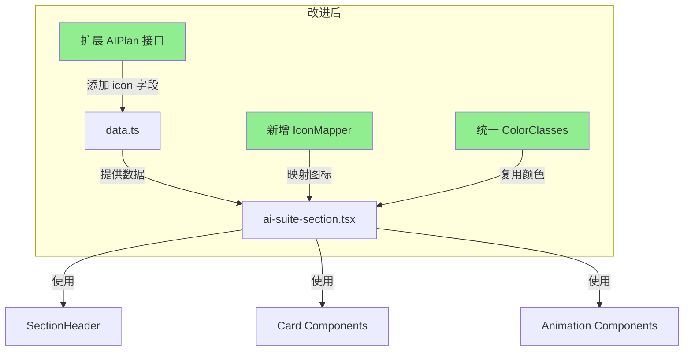

# AI-Suite 智能工具套件 - 设计分析与改进方案

## 一、当前实现问题列表

### 🔴 严重问题（Bug）

#### 1. CSS 类名语法错误
在多个文件中发现了 `font:` 这种错误的 CSS 类名写法（应该是 `font-`）：

**[`ai-suite-section.tsx`](app/(marketing)/pricing/modules/ai-suite/ai-suite-section.tsx)**
- 第 47 行：`font:semibold` → 应为 `font-semibold`
- 第 53 行：`font: bold` → 应为 `font-bold`  
- 第 57 行：`font: bold` → 应为 `font-bold`

**[`section-header.tsx`](app/(marketing)/pricing/shared/components/section-header.tsx)**
- 第 46 行：`font: bold` → 应为 `font-bold`

**[`pricing-card.tsx`](app/(marketing)/pricing/modules/pricing-plans/components/pricing-card.tsx)**
- 第 65 行：`font:bold` → 应为 `font-bold`
- 第 70 行：`font: bold` → 应为 `font-bold`

**影响**：这些错误会导致字体粗细样式完全不生效，标题和价格显示不正确。

---

### 🟡 设计不一致问题

#### 2. 卡片视觉层次缺失
- **问题**：AI-Suite 卡片没有图标，而 [`PricingCard`](app/(marketing)/pricing/modules/pricing-plans/components/pricing-card.tsx:30) 有明确的图标展示
- **影响**：用户难以快速识别不同套餐的定位

#### 3. "最受欢迎" 标签样式不统一
- AI-Suite 使用：`bg-cyan-500/20 text-cyan-400`
- PricingPlans 使用：渐变背景 `bg-gradient-to-r from-cyan-500 to-blue-500` + 星星图标
- **影响**：视觉风格不一致，用户体验割裂

#### 4. 颜色系统不完整
- [`getColorClasses`](app/(marketing)/pricing/modules/ai-suite/ai-suite-section.tsx:13) 函数只定义了文字颜色，没有背景色
- PricingCard 有完整的颜色对象：`{ bg, text, check }`

#### 5. 按钮样式差异
- AI-Suite featured 卡片：纯色 `bg-cyan-500`
- PricingCard featured 卡片：渐变 `bg-gradient-to-r from-cyan-500 to-blue-500`

---

### 🟠 布局与响应式问题

#### 6. 宽度限制不一致
- AI-Suite：使用 `max-w-5xl` 限制宽度
- PricingPlans：无宽度限制，充分利用容器
- **影响**：在大屏幕上两个区块的视觉宽度不一致

#### 7. 卡片高度不均
- 不同套餐的 features 数量不同（3-4项），可能导致卡片高度不一致
- 缺少 `h-full` 和 flex 布局来确保等高

---

### 🔵 动效与交互问题

#### 8. Hover 效果过于简单
当前 hover 效果：
```tsx
hover:bg-white/10 hover:border-white/20
```
缺少：
- scale 变换
- 图标的 hover 动画（如 PricingCard 的 `group-hover:scale-110`）

#### 9. 按钮交互反馈不足
- 没有使用 `ChevronRight` 图标引导用户
- 缺少点击时的视觉反馈

---

### ⚪ 内容丰富度问题

#### 10. 功能列表信息量不足
- 基础版仅 3 项功能
- 专业版 4 项功能
- 企业版 4 项功能
- 建议增加更多细节或使用 tooltip 展示额外信息

---

## 二、改进建议

### 优先级 1：修复 CSS 语法错误

```tsx
// 修复前
<CardTitle className="text-lg font: bold text-white">

// 修复后  
<CardTitle className="text-lg font-bold text-white">
```

### 优先级 2：统一设计语言

#### 2.1 添加图标支持

更新 [`data.ts`](app/(marketing)/pricing/modules/ai-suite/data.ts)：

```typescript
export interface AIPlan {
  name: string;
  icon: string;  // 新增
  price: string;
  unit: string;
  description: string;
  features: string[];
  color: "blue" | "cyan" | "violet";
  featured?: boolean;
}

export const aiPlans: AIPlan[] = [
  {
    name: "AI-Suite 基础版",
    icon: "zap",        // 新增
    price: "¥2,000.00",
    // ...
  },
  {
    name: "AI-Suite 专业版", 
    icon: "sparkles",   // 新增
    // ...
  },
  {
    name: "AI-Suite 企业版",
    icon: "building",   // 新增
    // ...
  },
];
```

#### 2.2 完善颜色系统

```tsx
const getColorClasses = (color: string) => {
  const classes = {
    blue: {
      bg: "bg-blue-500/20",
      text: "text-blue-400",
      icon: "text-blue-400",
      ring: "ring-blue-500/50",
    },
    cyan: {
      bg: "bg-cyan-500/20",
      text: "text-cyan-400", 
      icon: "text-cyan-400",
      ring: "ring-cyan-500/50",
    },
    violet: {
      bg: "bg-violet-500/20",
      text: "text-violet-400",
      icon: "text-violet-400", 
      ring: "ring-violet-500/50",
    },
  };
  return classes[color as keyof typeof classes] || classes.cyan;
};
```

#### 2.3 统一 "最受欢迎" 标签样式

```tsx
{plan.featured && (
  <div className="bg-gradient-to-r from-cyan-500 to-blue-500 text-white text-center py-2 text-sm font-semibold">
    <div className="flex items-center justify-center gap-1">
      <Star className="w-4 h-4 fill-current" />
      最受欢迎
    </div>
  </div>
)}
```

### 优先级 3：增强卡片组件

```tsx
<Card
  className={`h-full relative overflow-hidden transition-all duration-300 group ${
    plan.featured 
      ? `ring-2 ${colorClasses.ring} scale-[1.02] shadow-xl` 
      : "border-white/10 hover:border-white/20"
  } ${plan.featured ? "hover:shadow-2xl" : "hover:shadow-xl hover:bg-white/10"}`}
>
  {/* 图标区域 */}
  <CardHeader className={plan.featured ? "pt-4" : ""}>
    <div className={`w-12 h-12 rounded-xl ${colorClasses.bg} flex items-center justify-center mb-4 group-hover:scale-110 transition-transform duration-300`}>
      <IconComponent className={`w-6 h-6 ${colorClasses.icon}`} />
    </div>
    <CardTitle className="text-lg font-bold text-white">
      {plan.name}
    </CardTitle>
    {/* ... */}
  </CardHeader>

  {/* 内容区域使用 flex 确保等高 */}
  <CardContent className="flex flex-col h-full space-y-4">
    {/* ... */}
    <Button className="w-full mt-auto" asChild>
      <Link href="/contact">
        了解详情
        <ChevronRight className="w-4 h-4 ml-1" />
      </Link>
    </Button>
  </CardContent>
</Card>
```

### 优先级 4：移除宽度限制

```tsx
// 修改前
<StaggerContainer
  className="grid grid-cols-1 md:grid-cols-3 gap-6 lg:gap-8 max-w-5xl mx-auto"
>

// 修改后（与 PricingPlans 保持一致）
<StaggerContainer
  className="grid grid-cols-1 md:grid-cols-3 gap-6 lg:gap-8"
>
```

### 优先级 5：内容增强

```typescript
// 增加更多功能描述
{
  name: "AI-Suite 专业版",
  features: [
    "包含基础版全部功能",
    "AI图像生成（200张/月）",
    "广告智能优化 - 自动调整出价",
    "选品决策支持 - 数据驱动分析",
    "优先技术支持",
  ],
}
```

---

## 三、优先级排序

| 优先级 | 问题 | 影响 | 工作量 |
|--------|------|------|--------|
| P0 | CSS 类名语法错误 | 高 - 样式完全失效 | 低 |
| P1 | 设计不一致（标签、按钮） | 中 - 用户体验 | 低 |
| P2 | 添加图标支持 | 中 - 视觉识别 | 中 |
| P2 | 完善颜色系统 | 中 - 可维护性 | 低 |
| P3 | 增强动效 | 低 - 交互体验 | 低 |
| P3 | 移除宽度限制 | 低 - 布局一致性 | 低 |
| P4 | 内容增强 | 低 - 信息完整性 | 低 |

---

## 四、实现架构图



---

## 五、文件修改清单

1. **必须修改**
   - [`ai-suite-section.tsx`](app/(marketing)/pricing/modules/ai-suite/ai-suite-section.tsx) - 修复 CSS 错误，统一设计
   - [`section-header.tsx`](app/(marketing)/pricing/shared/components/section-header.tsx) - 修复 CSS 错误
   - [`pricing-card.tsx`](app/(marketing)/pricing/modules/pricing-plans/components/pricing-card.tsx) - 修复 CSS 错误

2. **建议修改**
   - [`data.ts`](app/(marketing)/pricing/modules/ai-suite/data.ts) - 添加图标定义
   - [`icon-mapper.ts`](app/(marketing)/pricing/lib/icon-mapper.ts) - 扩展图标映射

---

## 六、总结

当前 AI-Suite 组件存在严重的 CSS 语法错误需要立即修复，同时设计上与 PricingPlans 组件存在多处不一致。建议按照优先级顺序逐步改进，首先修复 bug，然后统一设计语言，最后进行体验优化。
